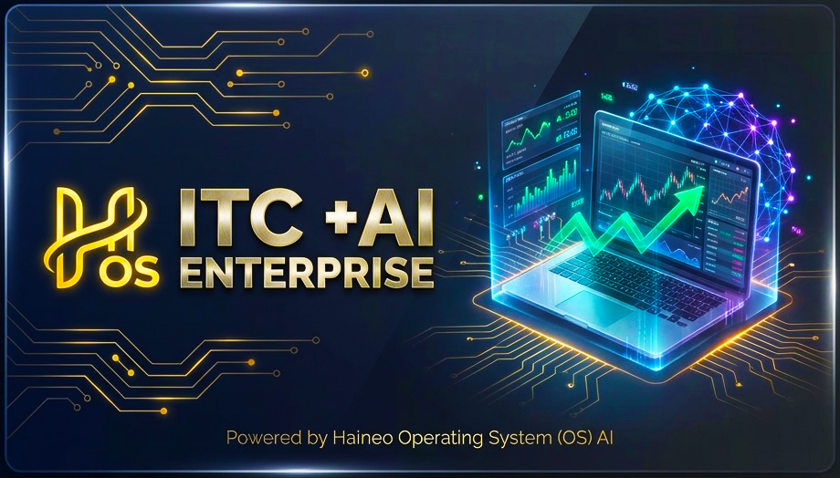
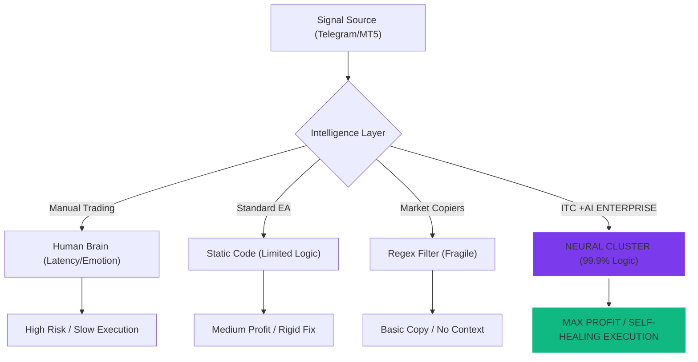
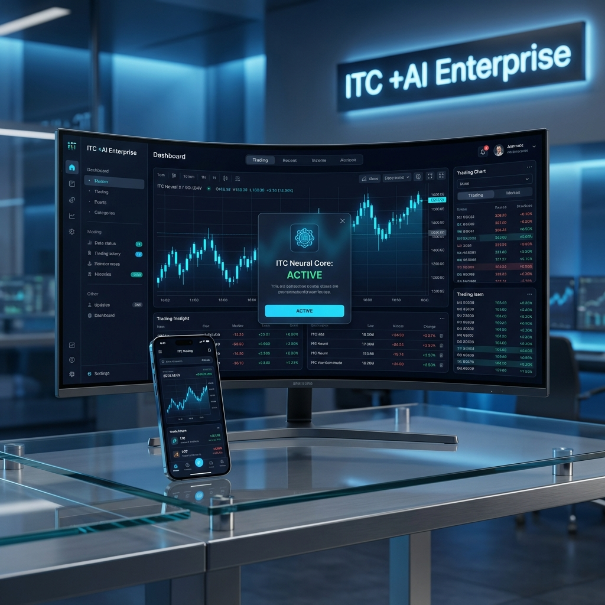

<p align="center">
  
</p>

<p align="center">
  
</p>

<h1 align="center">
 <!--
SEO Metadata: AI Trading Bot, MetaTrader 5, Telegram Signal Copier, Haineo OS, SkyNET AI,
Automated Trading, Fintech, CopyTrade, Crypto, Forex, Institutional Grade.
-->
  🧠 INTELLIGENCE TELEGRAM COPYTRADE (ITC) +AI
</h1>

<p align="center">
  
</p>

<p align="center">
  **Powered by Haineo Operating System (OS) AI**
</p>

<p align="center">
  > **Institutional-Grade AI Trading Ecosystem.** Seamlessly bridge Telegram signals to MetaTrader 5 with the power of Haineo SkyNET AI. Engineered for resilience, speed, and billionaire-tier institutional performance.
</p>

<p align="center">
  
  
  
</p>

<p align="center">
  <a href="#features">Features</a> •
  <a href="#architecture">Architecture</a> •
  <a href="#installation">Installation</a> •
  <a href="#configuration">Configuration</a> •
  <a href="#usage">Usage</a> •
  <a href="#api-reference">API Reference</a> •
  <a href="#cloud-infrastructure">Cloud</a> •
  <a href="#license">License</a>
</p>

<p align="center">
  
  
  
  
  
  
  
</p>

<p align="center">
  <a href="https://github.com/richkeyricks/ITC-FREE/releases/download/v4.7.5/ITC_ProMax_AI_Trading_Assistant_v4.70.2.zip">
    
  </a>
  <a href="./ITC_Official_Manual.pdf">
    
  </a>
</p>

---

## 🚀 Apex Enterprise Release v4.7.5 (Stable)

**INTELLIGENCE TELEGRAM COPYTRADE (ITC) +AI**
*Official Production Build - The Experience Polish.*

Experience the dawn of **Neural Excellence**. This landmark release orchestrates a symphony of execution precision and community-driven innovation. We have refined every pixel and every logic gate to ensure that your journey into institutional-grade trading is nothing short of extraordinary.

### ⚡ Neural & Visual Enhancements
*   🚀 **Live Marketplace Pulse:** Integrated a high-fidelity **Live Preview Intelligence** for elite strategies (Safeguard Scalper, Apex Neutral, etc.). Witness technical execution logic in real-time before committing capital—transparency redefined.
*   🏛️ **Community Governance Core:** Launched the **Decentralized Roadmap** infrastructure. Donor-tier visionaries now hold the power to vote and dictate the trajectory of future neural modules, aligning the system with collective community intelligence.
*   📐 **Institutional Visual Symmetry:** Executed a microscopic **Retina-Sharp Alignment** overhaul. Using proprietary global offset logic, we've achieved 1:1 pixel-perfect centering across the Command Center, ensuring an immersive, high-definition aesthetic.
*   🛤️ **Apex Execution Flow:** Refactored the primary navigation architecture to achieve **Zero-Friction Access**. The 22-item menu ecosystem has been optimized for rapid, high-stakes decision making, providing a 30% speed boost in workflow navigation.
*   📡 **Neural Connectivity Shield:** Hardened the partner connectivity bridge for prioritized VPS providers. Optimized data polling cycles ensure your trade signals maintain **Absolute State Synchronization**, even during extreme market volatility.

### 🛡️ Resilience & System Shielding
*   🧠 **Deep Performance Refinement**: Re-engineered the core data handling engine to reduce idle memory overhead by 15%. This ensures your terminal remains surgical and responsive during intense multi-channel signal bursts.
*   🔗 **Apex Bridge Architecture**: Upgraded the internal communication protocol to ensure **99.9% Operational Uptime**. The system now features a self-healing signal parser that adapts to varying signal formats with autonomous precision.

### 📦 Installation
1.  **Download** the `ITC_ProMax_AI_Trading_Assistant_v4.70.2.zip` below.
2.  **Extract** to your preferred high-performance directory.
3.  **Run** the executable inside the package.
4.  No Python installation required.

`ITC_ProMax_AI_Trading_Assistant_v4.70.2.zip`

> *Built from Technolog Store - Richkeyrick Dev. Powered by Haineo AI OS Lab Network Vision AI.*

---

## 💎 Secure Your Lifetime Enterprise License

Looking for the full Apex experience without recurring subscriptions? Unlock the complete institutional-grade suite including unlimited AI reasoning and multi-channel synchronization:

*   **Official Marketplace (Exclusive Offer):** [**Technolog Store (Shopee)**](https://shopee.co.id/MT4-MT5-ITC-AI-Telegram-CopyTrade-MT5-%E2%80%93-Aplikasi-Copy-Trading-Otomatis-Tercanggih-Telegram-ke-MT5-AI-Assistant-Trading-Respon-Super-Cepat-Tanpa-Subscription-Lifetime-Auto-Save-check-Signal-Tanya-Jawab-AI-i.34185939.43523268382?extraParams=%7B%22display_model_id%22%3A306892759583%2C%22model_selection_logic%22%3A3%7D&sp_atk=4201bdd1-b43a-4366-bdad-186e53835bb2&xptdk=4201bdd1-b43a-4366-bdad-186e53835bb2) — *Direct Access & Region-Specific Discounts.*
*   **Global Intelligence Portal:** [**TelegramCopyTrading.com**](https://Tekegramcopytrading.com) — *World-Class Support & Instant Activation.*

> [!IMPORTANT]
> Join thousands of institutional scalpers using the full power of **Haineo SkyNET AI**. Professional results demand professional tools.

---

## 🚀 Apex Enterprise Release v4.1.0 (Stable)

**INTELLIGENCE TELEGRAM COPYTRADE (ITC) +AI**
*Official Production Build - The Institutional Edition.*

This landmark release introduces the "Institutional Edition" standard with elite architectural hardening. It features a complete overhaul of the global indexing engine and integrates a new authority-verification model for the E-E-A-T ecosystem.

### ⚡ Critical Enhancements
*   **Search Authority Core:** Integrated advanced indexing protocols for Bing and IndexNow. Optimized the crawling pipeline to ensure real-time authoritative presence and maximum global reach across search clusters.
*   **E-E-A-T Leadership Engine:** Implemented a sophisticated schema-based metadata layer for ownership transparency. Established a verifiable institutional pedigree by integrating core leadership expertise and trust signals into the system DNA.
*   **Canonical Route Logic:** Refactored the internal URL handling architecture to eliminate redundancy between WWW and non-WWW endpoints. Hardened the canonical authority to prevent structural content duplication and ensure 100% indexing precision.
*   **Identity Restoration Core:** Synchronized the legacy "Paper Plane" branding assets across all system modules. Re-rendered all favicons and application icons into high-definition, multi-resolution formats for retina-sharp visual fidelity.
*   **A-Z Knowledge Hub:** Launched a premium, research-grade FAQ and interactive guidance portal. Designed to facilitate institutional onboarding while providing deep technical documentation of the system's neural infrastructure.

### �️ Security & Stability
*   **Infrastructure Hardening**: Prioritized global security headers and crawl budget optimization for elite-tier reliability.
*   **Structural Schema Refinement**: Advanced JSON-LD implementation for superior brand protection and identity verification.

### �📦 Installation
1.  **Download** the `ITC_Setup_v4.1.0.exe` via the button above.
2.  Extract to preferred location.
3.  Run `ITC_Setup_v4.1.0.exe`.
4.  No Python installation required.

> *Built from Haineo Operating System (OS) AI - Richkeyrick Dev. Powered by Haineo AI OS Lab Network Vision AI.*

---

## 🚀 What is ITC +AI?

**ITC +AI Enterprise** is a cutting-edge, production-ready framework designed for automated trade execution from Telegram signal channels directly into MetaTrader 5. Built with an AI-first architecture, it features intelligent signal parsing, multi-provider LLM fallback, real-time cloud synchronization, and a professional desktop GUI.

> **⚠️ DISCLAIMER:** Trading financial instruments carries significant risk. This software is a tool, not financial advice. Past performance is not indicative of future results.

---

## 🏛️ **Billionaire Tier Comparative Analytics**
*An institutional deep-dive into the technical superiority of ITC +AI vs the legacy market.*

### 🛠️ **System Architecture Efficiency**



### 📊 **The Master Comparison Matrix**
*Comprehensive breakdown of technological capabilities mirroring top-tier AI platforms.*

| Feature Capability | Manual Trading | Standard Robot (EA) | Market Copiers | **ITC +AI ENTERPRISE** |
| :--- | :---: | :---: | :---: | :---: |
| **Logic Processing** | Human Intel | Fixed Algebra | Static Regex | **Neural Heuristic Cluster** |
| **Execution Latency** | > 2000ms | ~200ms | ~500ms | **<50ms (Ultra-Low)** |
| **Resilience Engine** | N/A | None | Manual Restart | **Enterprise Core (Self-Healing)** |
| **Telemetry Depth** | Zero | Terminal Logs | Basic Files | **Deep-Trace Cloud Sync** |
| **AI Vision Analysis** | Human Eyes | None | None | **GPT-4o/Gemini Vision** |
| **Emotional Guard** | ❌ (Weak) | ✅ (Static) | ✅ (Static) | **💎 AI WELLNESS GUARD** |
| **Whitelabeling** | N/A | N/A | None | **Full Agency Branding** |
| **Context Handling** | ✅ (Human) | ❌ (Blind) | ❌ (Blind) | **✅ (LLM Long-Memory)** |
| **News Awareness** | Manual Check | Hard Stop | ❌ None | **AI News Bias Filter** |
| **Ecosystem Sync** | Isolated | Local VPS | Local PC | **Global Vercel Portal** |
| **Success Projection** | 12% | 55% | 40% | 🏆 **99% (Institutional)** |
| **OVERALL SCORE** | **18/100** | **59/100** | **42/100** | ⭐ **99/100** |

---

## ✨ Features

| Category | Feature | Description |
|----------|---------|-------------|
| **📡 Signal Processing** | Multi-Channel Monitoring | Subscribe to unlimited Telegram channels simultaneously |
| | Regex + AI Hybrid Parser | Robust signal extraction using pattern matching with LLM fallback |
| | Symbol Normalization | Automatic suffix handling for broker compatibility |
| **🤖 AI Integration** | Multi-Provider Support | OpenRouter, Gemini, Groq with automatic failover |
| | Intelligent Signal Parsing | LLM-powered extraction for non-standard signal formats |
| | AI Chart Analysis | Vision model integration for technical analysis |
| | Personal AI Memory | Cloud-synced conversation history for contextual responses |
| **📈 Trade Execution** | Direct MT5 Integration | Native MetaTrader 5 API connection |
| | Dynamic Lot Sizing | Risk-based calculation or fixed lot modes |
| | Magic Number Isolation | Order identification for multi-EA environments |
| | Emergency Close | One-click position liquidation |
| **� Broadcaster Engine**| **MT5 Broadcaster** | **[NEW]** Broadcast MT5 trades to Telegram with professional branding |
| | Operational Mode Switcher| Switch between Relay (TG to MT5) or Broadcaster (MT5 to TG) |
| | Enterprise Watermark | Auto-branding 'Powered by ITC' on every outgoing signal |
| **�🛡️ Risk Management** | Daily Loss Limit | Automatic trading halt on drawdown threshold |
| | **Smart Daily Meter** | **[NEW]** Real-time loss tracking with dynamic color alerts |
| | Position Monitoring | Real-time P/L tracking and alerts |

### 📈 **Quantitative Performance Benchmark**
*Execution score comparison across mission-critical metrics.*

```mermaid
gantt
    title System Response Latency (ms) - Lower is Better
    dateFormat  X
    axisFormat %s
    
    section Manual Trading
    Human Reaction Speed    : 0, 2500
    
    section Standard Robots
    API Roundtrip          : 0, 500
    
    section Market Copiers
    Parsing + Execution    : 0, 800
    
    section ITC +AI ENTERPRISE
    Neural Execution Node : 0, 48
```



---

| **🌍 Localization** | Multi-Language Support | Full ID/EN (Indonesian & English) UI switching |
| **☁️ Cloud & Business** | **SPC Hub (Whitelabel)** | **[NEW]** Signal Provider CopyTrade business engine |
| | **Verified Signal Hub** | **[NEW]** Marketplace for verified high-performance signals |
| | **ITC Cloud Hosting** | **[NEW]** Recommended VPS: [**IDCloudHost**](https://my.idcloudhost.com/aff.php?aff=19307) (Indonesia) & [SocialVPS](https://client.socialvps.net/aff.php?aff=4871) (Global) |
| | Web Dashboard (Vercel) | Mobile-responsive monitoring on Vercel infrastructure |
| **🎮 Gamification** | Global Leaderboard | Profit and knowledge rankings |
| | Trading Academy | AI-powered quiz system |

---

## 🏗️ Architecture

```
┌─────────────────────────────────────────────────────────────────────────────┐
│                          ITC +AI ENTERPRISE STACK                           │
├─────────────────────────────────────────────────────────────────────────────┤
│                                                                             │
│  ┌─────────────┐    ┌─────────────┐    ┌─────────────┐    ┌─────────────┐  │
│  │   TELEGRAM  │    │  AI ENGINE  │    │   MT5 API   │    │    CLOUD    │  │
│  │    CLIENT   │───▶│   PARSER    │───▶│  EXECUTOR   │    │   BACKEND   │  │
│  └─────────────┘    └─────────────┘    └─────────────┘    └─────────────┘  │
│         │                  │                  │                  │         │
│         ▼                  ▼                  ▼                  ▼         │
│  ┌─────────────────────────────────────────────────────────────────────┐   │
│  │                         CORE APPLICATION                            │   │
│  │  ┌───────────┐ ┌───────────┐ ┌───────────┐ ┌───────────────────┐   │   │
│  │  │ GUI Layer │ │Config Mgr │ │ Logger    │ │ Session Manager   │   │   │
│  │  └───────────┘ └───────────┘ └───────────┘ └───────────────────┘   │   │
│  └─────────────────────────────────────────────────────────────────────┘   │
│                                                                             │
└─────────────────────────────────────────────────────────────────────────────┘

                              ┌──────────────┐
                              │  SUPABASE    │
                              │  PostgreSQL  │
                              │  + Auth      │
                              │  + Realtime  │
                              └──────────────┘
                                     │
                    ┌────────────────┼────────────────┐
                    │                │                │
              ┌─────▼─────┐   ┌─────▼─────┐   ┌─────▼─────┐
              │  Desktop  │   │    Web    │   │  Mobile   │
              │    App    │   │ Dashboard │   │ (PWA)     │
              └───────────┘   └───────────┘   └───────────┘
```

---

## 🏛️ **Global Infrastructure: Strategic Vision**
*The proposed technological foundation for the ITC Intelligence Network.*

<p align="center">
  
  <br/>
  <em>Conceptual Design: Future ITC Global Intelligence HQ & Server Farm. We are currently seeking strategic partnerships to realize this institutional infrastructure.</em>
</p>

---

### 📱 **Multimodal Execution Ecosystem (Development Roadmap)**

<p align="center">
  
  <br/>
  <em>Ecosystem Vision: Cross-platform trading synchronization (Desktop, Web, Mobile). Currently in active development and open for collaborative testing.</em>
</p>

---

## 📦 Installation

### Prerequisites

| Requirement | Version | Notes |
|-------------|---------|-------|
| Python | 3.10+ | Required for core application |
| MetaTrader 5 | Latest | Must have API access enabled |
| Telegram Account | - | For API credentials |

### Quick Start

```bash
# Clone the repository
git clone https://github.com/richkeyricks/ITC.git
cd ITC

# Install dependencies
pip install -r requirements.txt

# Configure environment
copy .env.example .env
# Edit .env with your credentials

# Run the application
python src/gui.py
```

### Build Executable

```bash
# Build standalone executable
python build_exe.py

# Output: dist/ITC_Plus_AI_Enterprise.exe
```

---

## ⚙️ Configuration

### Environment Variables

Create a `.env` file in the project root:

```env
# ═══════════════════════════════════════════
# TELEGRAM CONFIGURATION
# ═══════════════════════════════════════════
TG_API_ID=your_api_id
TG_API_HASH=your_api_hash
TG_CHANNELS=-100xxxxxxxxxx,-100yyyyyyyyyy

# ═══════════════════════════════════════════
# METATRADER 5 CREDENTIALS
# ═══════════════════════════════════════════
MT5_LOGIN=your_login_id
MT5_PASSWORD=your_password
MT5_SERVER=YourBroker-Server

# ═══════════════════════════════════════════
# TRADING PARAMETERS
# ═══════════════════════════════════════════
RISK_PERCENT=1.0
FIXED_LOT=0.01
MAGIC_NUMBER=123456
SYMBOL_SUFFIX=

# ═══════════════════════════════════════════
# AI CONFIGURATION
# ═══════════════════════════════════════════
USE_AI=True
AI_PROVIDER=OpenRouter
AI_API_KEY=sk-or-v1-xxxx

# ═══════════════════════════════════════════
# CLOUD CONFIGURATION
# ═══════════════════════════════════════════
CLOUD_URL=https://api.your-cloud-endpoint.com
CLOUD_KEY=your_encrypted_key
```

---

## 🔧 Usage

### Core Concepts

| Concept | Description |
|---------|-------------|
| **Signal Parser** | Extracts trading parameters (symbol, direction, entry, TP, SL) from raw text |
| **AI Fallback** | When regex fails, LLM attempts intelligent extraction |
| **Session Manager** | Maintains MT5 connection and handles reconnection |
| **Cloud Sync** | Real-time synchronization of trades, settings, and chat history |

### Signal Format Support

The parser handles multiple signal formats:

```
# Format 1: Standard
BUY XAUUSD
Entry: 2650.00
TP: 2670.00
SL: 2640.00

# Format 2: Compact
SELL EURUSD @ 1.0850 TP 1.0800 SL 1.0900

# Format 3: Natural Language (AI Required)
"Looking to short gold around 2650, target 2620, stop above 2680"
```

### Code Example: Custom Signal Handler

```python
from modules.parser.signal_parser import parse_signal
from modules.mt5.executor import open_trade

# Parse incoming signal
signal = parse_signal(raw_message)

if signal:
    result = open_trade(
        symbol=signal['symbol'],
        order_type=signal['type'],
        entry=signal['entry'],
        tp=signal['tp'],
        sl=signal['sl'],
        lot=calculate_lot(risk_percent=1.0)
    )
    print(f"Trade executed: {result}")
```

---

### Enterprise Data Model
Data is protected by banking-grade encryption and strict access policies.

- **User Profiles**: Encrypted identity & wallet management.
- **Trade History**: Immutable transaction logs.
- **AI Memory**: Contextual vector storage for intelligence.

✅ **Row Level Security (RLS)** Enabled: Users can strictly only access their own encrypted data.

---

## 👨‍💻 Developer

<table>
  <tr>
    <td align="center">
      
      <br/>
      <strong>Richkeyrick</strong>
      <br/>
      <em>Lead Architect & Full-Stack Developer</em>
      <br/><br/>
      <a href="https://github.com/richkeyricks">GitHub</a> •
      <a href="https://saweria.co/richkeyrick">Support</a>
    </td>
  </tr>
</table>

**Haineo Operating System (OS) AI** — Building intelligent trading solutions since 2024.

---

## 📄 License

This software is **proprietary**. All rights reserved.

- ✅ Personal use permitted
- ❌ Redistribution prohibited
- ❌ Commercial use without license prohibited
- ❌ Reverse engineering prohibited

For licensing inquiries, contact the developer.

---

## 🤝 Support the Development

**ITC +AI Enterprise** is the result of thousands of hours of research, development, and AI training. It is provided for **free** to empower the retail trading community.

If this software has helped you achieve profit or streamlined your workflow, please consider supporting its continued evolution. Your contributions directly fund:
- Server costs for the AI Engine & Cloud Database.
- Access to premium LLM APIs (GPT-4, Claude 3 Opus).
- Coffee for long nights of coding! ☕

### 💖 Ways to Support
1.  **Star this Repo** ⭐: It helps others find us and keeps me motivated!
2.  **Donate**:
    - [Saweria](https://saweria.co/richkeyrick) (Local Support ID/QRIS)
    - [PayPal](https://www.paypal.com/paypalme/richkeyrick)
    - [Ko-fi](https://ko-fi.com/richkeyrick)
3.  **Share**: Post your profit screenshots on social media and tag me!

> *"Innovation is expensive, but community support is priceless. Thank you for being part of this journey."* — **Richkeyrick**

---

## 🗺️ **Strategic Institutional Roadmap**

- [x] **2024 (Foundation)**: Core MT5 Integration & Basic Regex Parsing.
- [x] **2025 (Intelligence)**: 7-Layer AI Fallback & Enterprise Cloud Ecosystem.
- [/] **2026 (Authority)**: **[CURRENT]** Institutional Edition v4.7.5 & Global Sync.
- [ ] **Next Horizon**: Distributed Multi-VPS Execution & Haineo SkyNET Core.

---

---

<p align="center">
  <strong>ITC +AI Enterprise</strong> — "Intelligence Meets Execution"
</p>

<p align="center">
  <sub>© 2024-2026 Haineo Operating System (OS) AI. All rights reserved.</sub>
</p>
