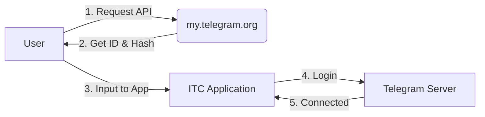

# PANDUAN RESMI INSTALASI & PENGGUNAAN ITC COPYTRADING
# OFFICIAL INSTALLATION & USAGE GUIDE - ITC COPYTRADING

> **Versi / Version:** 4.9.5
> **Dokumen / Document:** ITC-TUT-001
> **Tanggal / Date:** 15 Februari 2026

---

## DAFTAR ISI / TABLE OF CONTENTS

1.  [Download & Instalasi / Download & Installation](#1-download--instalasi--download--installation)
2.  [Registrasi Akun / Account Registration](#2-registrasi-akun--account-registration)
3.  [Koneksi Telegram / Telegram Connection](#3-koneksi-telegram--telegram-connection)
4.  [Menghubungkan MT5 / Connecting MT5](#4-menghubungkan-mt5--connecting-mt5)
5.  [Mulai Copy Trading / Start Copy Trading](#5-mulai-copy-trading--start-copy-trading)

---

## 1. DOWNLOAD & INSTALASI / DOWNLOAD & INSTALLATION

Langkah pertama untuk memulai perjalanan trading otomatis Anda.
*The first step to starting your automated trading journey.*

### Langkah-langkah / Steps:

1.  **Kunjungi Website Resmi / Visit Official Website:**
    Buka browser Anda dan kunjungi / Open your browser and visit:
    [www.Telegramcopytrading.com/download](http://www.Telegramcopytrading.com/download)

2.  **Download Installer:**
    Klik tombol **"Download for Windows"**. File akan tersimpan sebagai `ITC_Setup_v4.9.5.exe` atau `.zip`.
    *Click the **"Download for Windows"** button. The file will be saved as `ITC_Setup_v4.9.5.exe` or `.zip`.*

3.  **Instalasi / Installation:**
    -   Jika file berupa `.zip`, ekstrak terlebih dahulu.
        *If the file is a `.zip`, extract it first.*
    -   Klik kanan pada file `.exe` dan pilih **"Run as Administrator"**.
        *Right-click on the `.exe` file and select **"Run as Administrator"**.*
    -   Ikuti petunjuk di layar sampai selesai.
        *Follow the on-screen instructions until valid.*

4.  **Peringatan Windows / Windows Warning:**
    Jika muncul peringatan "Windows protected your PC", klik **"More info"** lalu **"Run anyway"**. Ini normal untuk aplikasi trading baru.
    *If a "Windows protected your PC" warning appears, click **"More info"** then **"Run anyway"**. This is normal for new trading applications.*

---

## 2. REGISTRASI AKUN / ACCOUNT REGISTRATION

Anda memerlukan akun ITC untuk menyimpan konfigurasi di Cloud.
*You need an ITC account to save configurations to the Cloud.*

1.  Buka aplikasi ITC +AI.
    *Open the ITC +AI application.*
2.  Pada halaman login, klik **"Buat Akun Baru"** atau **"Sign Up"**.
    *On the login page, click **"Create New Account"** or **"Sign Up"**.*
3.  Isi Nama, Email, dan Password Anda.
    *Fill in your Name, Email, and Password.*
4.  Klik **"DAFTAR SEKARANG"**.
    *Click **"SIGN UP NOW"**.*
5.  **PENTING:** Cek email Anda (Inbox/Spam) untuk mengonfirmasi pendaftaran. Anda tidak bisa login sebelum verifikasi email.
    * **IMPORTANT:** Check your email (Inbox/Spam) to confirm registration. You cannot login before email verification.*

---

## 3. KONEKSI TELEGRAM / TELEGRAM CONNECTION

Ini adalah langkah paling krusial. Ikuti dengan teliti agar robot bisa membaca sinyal.
*This is the most crucial step. Follow carefully so the robot can read signals.*

### A. Mendapatkan API ID & Hash / Getting API ID & Hash

1.  Buka browser dan kunjungi: **[my.telegram.org](https://my.telegram.org)**
    *Open browser and visit: **[my.telegram.org](https://my.telegram.org)***
2.  Masukkan nomor HP Telegram Anda (contoh: `+62812...`). Klik **Next**.
    *Enter your Telegram phone number (e.g., `+62812...`). Click **Next**.*
3.  Telegram akan mengirimkan kode konfirmasi ke aplikasi Telegram di HP Anda (Bukan SMS).
    *Telegram will send a confirmation code to your Telegram mobile app (Not SMS).*
4.  Masukkan kode tersebut di website dan klik **Sign In**.
    *Enter the code on the website and click **Sign In**.*
5.  Klik menu **"API development tools"**.
    *Click the **"API development tools"** menu.*
6.  Isi formulir "Create new application":
    *Fill the "Create new application" form:*
    -   **App title:** `ITC CopyTrade`
    -   **Short name:** `itccopy`
    -   **Platform:** `Desktop`
    -   (Biarkan yang lain kosong / *Leave others empty*)
7.  Klik **"Create application"**.
8.  Anda akan melihat **App api_id** (angka) dan **App api_hash** (huruf & angka). **JANGAN BERIKAN KODE INI KE SIAPAPUN!**
    *You will see **App api_id** (numbers) and **App api_hash** (alphanumeric). **DO NOT SHARE THESE CODES!***

### B. Konfigurasi di Aplikasi / Configuration in App

1.  Di aplikasi ITC, buka menu **Telegram Config**.
    *In ITC app, open **Telegram Config** menu.*
2.  Masukkan **API ID** dan **API Hash** yang Anda dapatkan tadi.
    *Enter the **API ID** and **API Hash** you obtained earlier.*
3.  Masukkan nomor HP Telegram Anda.
    *Enter your Telegram phone number.*
4.  Klik **"UJI KONEKSI"** / **"TEST CONNECTION"**.
    *Click **"UJI KONEKSI"** / **"TEST CONNECTION"**.*
5.  Akan muncul popup meminta kode OTP. Cek Telegram Anda lagi, masukkan kodenya.
    *A popup will appear asking for OTP. Check your Telegram again, enter the code.*
6.  Jika sukses, status akan berubah menjadi **TERHUBUNG / CONNECTED**.
    *If successful, status will change to **TERHUBUNG / CONNECTED**.*

### Diagram Koneksi / Connection Diagram

---

## 4. MENGHUBUNGKAN MT5 / CONNECTING MT5

Robot perlu izin untuk melakukan trading di akun MetaTrader 5 Anda.
*The robot needs permission to trade on your MetaTrader 5 account.*

### Persiapan MT5 / MT5 Preparation

1.  Buka aplikasi MT5 Desktop Anda.
    *Open your MT5 Desktop application.*
2.  Menu **Tools** -> **Options** -> **Expert Advisors**.
3.  Centang / Check:
    -   ✅ **Allow algorithmic trading**
    -   ✅ **Allow DLL imports** (Wajib/Mandatory)
4.  Klik **OK**. Pastikan tombol "Algo Trading" di toolbar atas berwarna HIJAU (Play).
    *Click **OK**. Ensure "Algo Trading" button on top toolbar is GREEN (Play).*

### Konfigurasi ITC / ITC Configuration

1.  Buka menu **Akun MT5 / MT5 Account** di ITC.
    *Open **Akun MT5 / MT5 Account** menu in ITC.*
2.  Isi form:
    -   **Login:** Nomor akun MT5 (Angka).
    -   **Password:** Password trading (Bukan investor).
    -   **Server:** Nama server broker (Harus persis sama, besar kecil huruf).
    -   **Path:** (Opsi Auto biasanya sudah benar).
3.  Klik **"UJI LOGIN"** / **"TEST LOGIN"**.
    *Click **"UJI LOGIN"** / **"TEST LOGIN"**.*
4.  Pastikan muncul centang hijau **SUKSES**.
    *Ensure green **SUCCESS** checkmark appears.*

---

## 5. MULAI COPY TRADING / START COPY TRADING

1.  Pergi ke **Dashboard**.
    *Go to **Dashboard**.*
2.  Pastikan 3 lampu indikator (Internet, Telegram, MT5) berwarna **HIJAU / GREEN**.
    *Ensure 3 indicator lights (Internet, Telegram, MT5) are **HIJAU / GREEN**.*
3.  Klik tombol besar **"MULAI COPIER"** / **"START COPIER"**.
    *Click the big **"MULAI COPIER"** / **"START COPIER"** button.*
4.  Status akan berubah menjadi **"BERJALAN..." / "RUNNING..."**.
    *Status will change to **"BERJALAN..." / "RUNNING..."**.*
5.  Selesai! Aplikasi sekarang memantau channel Telegram yang Anda masukkan dan akan mengeksekusi di MT5.
    *Done! The app is now monitoring your input Telegram channels and will execute on MT5.*
