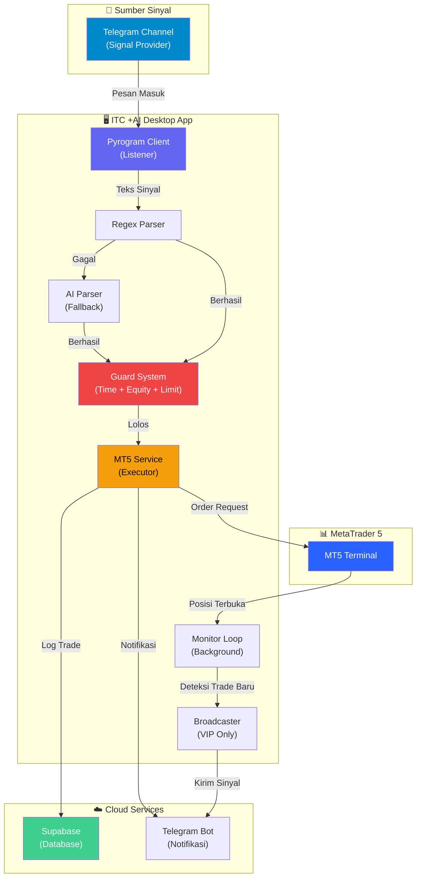
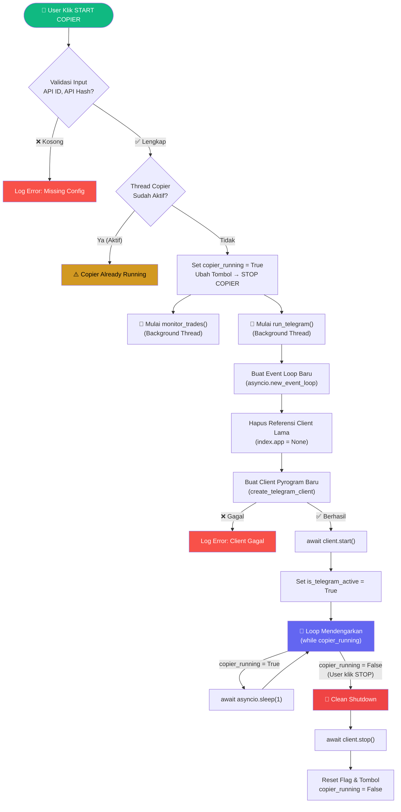
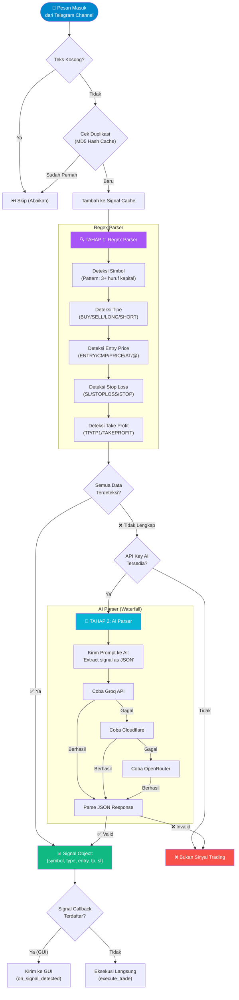
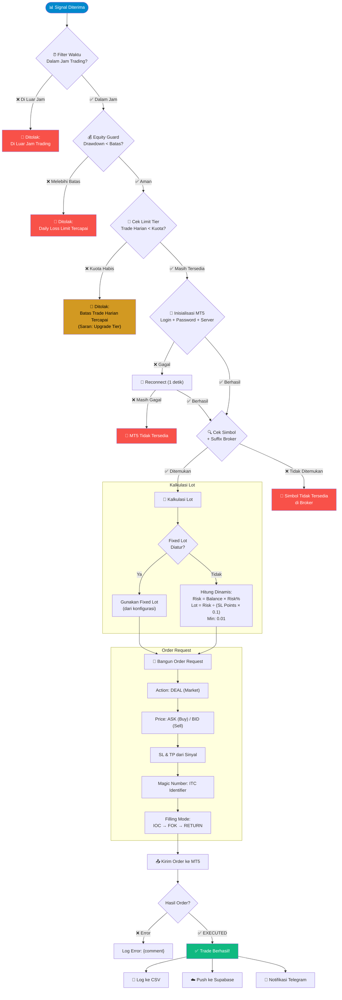
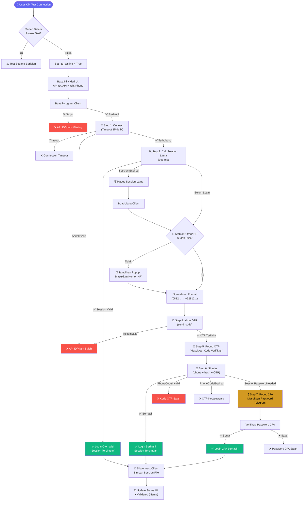
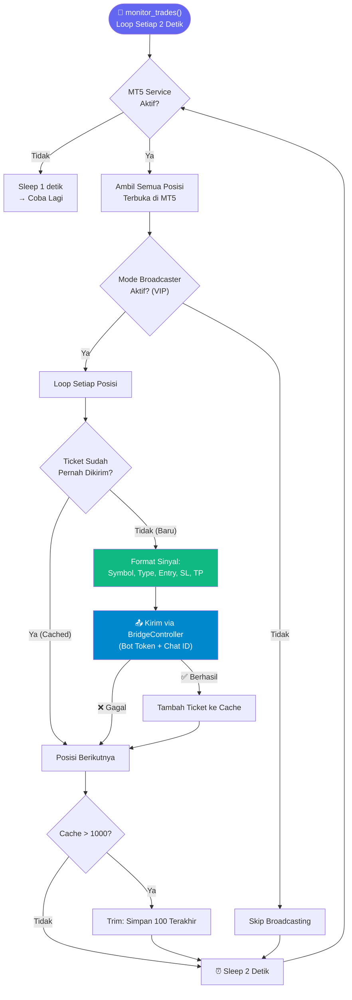
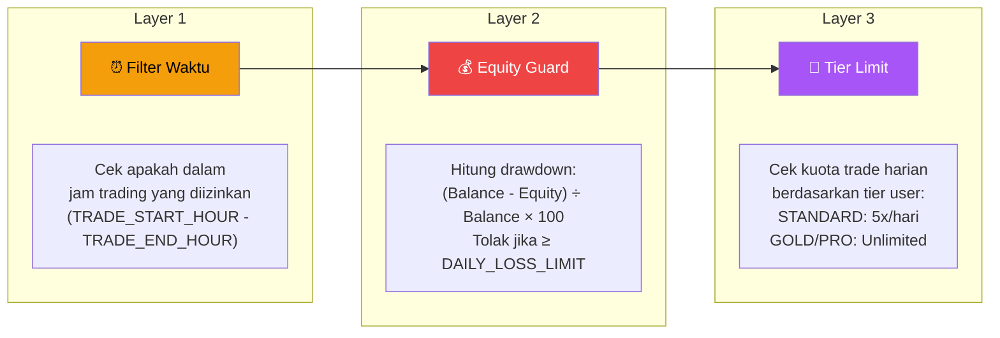
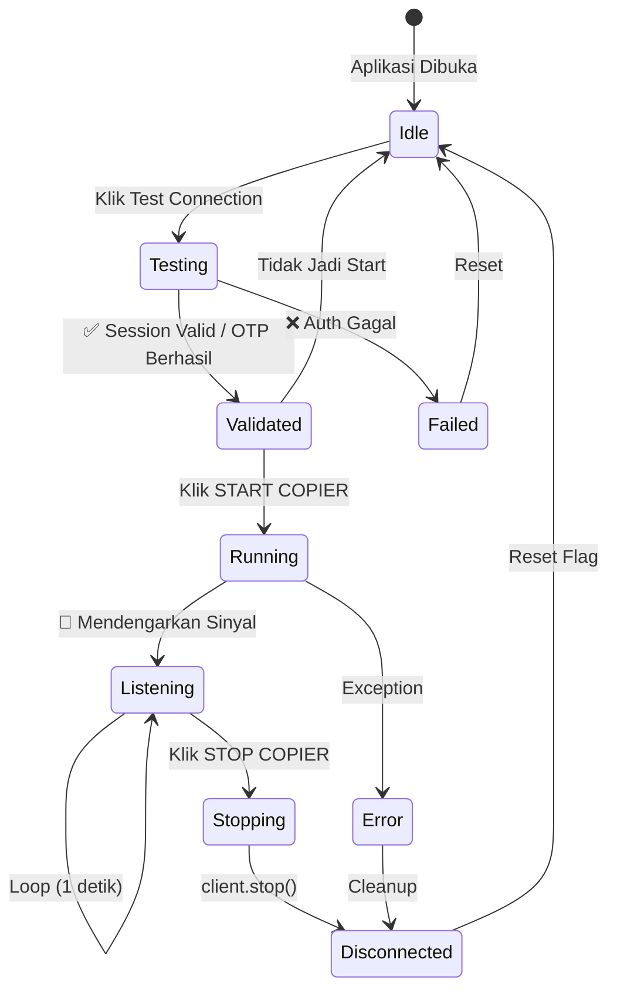

# 📡 ITC +AI — Dokumentasi Workflow CopyTrading

> **Versi Dokumen:** v4.9.5
> **Terakhir Diperbarui:** 15 Februari 2026
> **Bahasa:** Indonesia

---

## 1. Arsitektur Umum Sistem

Diagram berikut menunjukkan arsitektur tingkat tinggi dari seluruh sistem ITC CopyTrading.

### 📋 Visual: Alur Data Sistem

```
┌─────────────────────┐
│  📱 TELEGRAM CHANNEL │  (Sumber Sinyal Trading)
│  (Signal Provider)   │
└─────────┬───────────┘
          │ Pesan Masuk
          ▼
┌─────────────────────────────────────────────────────┐
│  🖥️  ITC +AI DESKTOP APPLICATION                    │
│                                                     │
│  ┌──────────────┐    ┌──────────────┐               │
│  │  Pyrogram    │───▶│ Regex Parser │──── Berhasil ─▶│
│  │  Client      │    │ (Tahap 1)    │               │
│  │  (Listener)  │    └──────┬───────┘               │
│  └──────────────┘           │ Gagal                 │
│                             ▼                       │
│                    ┌──────────────┐                  │
│                    │  AI Parser   │──── Berhasil ─┐  │
│                    │  (Tahap 2)   │               │  │
│                    └──────────────┘               │  │
│                                                   ▼  │
│                    ┌──────────────────────────────┐  │
│                    │  🛡️ GUARD SYSTEM              │  │
│                    │  • Filter Waktu              │  │
│                    │  • Equity Guard              │  │
│                    │  • Tier Limit                │  │
│                    └──────────┬───────────────────┘  │
│                               │ Lolos                │
│                               ▼                      │
│                    ┌──────────────┐                  │
│                    │  MT5 Service │─── Order ──┐     │
│                    │  (Executor)  │            │     │
│                    └──────────────┘            │     │
│                                               │     │
│  ┌──────────────┐                             │     │
│  │ Monitor Loop │◀── Posisi Terbuka ──────────┤     │
│  │ (Background) │                             │     │
│  └──────┬───────┘                             │     │
│         │ Trade Baru (VIP)                    │     │
│         ▼                                     │     │
│  ┌──────────────┐                             │     │
│  │ Broadcaster  │                             │     │
│  │ (VIP Only)   │                             │     │
│  └──────┬───────┘                             │     │
└─────────┼─────────────────────────────────────┼─────┘
          │                                     │
          ▼                                     ▼
┌──────────────────┐              ┌──────────────────┐
│ ☁️ Telegram Bot   │              │ 📊 MetaTrader 5   │
│ (Notifikasi)     │              │ (Terminal)        │
└──────────────────┘              └──────────────────┘
          │
          ▼
┌──────────────────┐
│ ☁️ Supabase       │
│ (Database Cloud) │
└──────────────────┘
```

### 🔗 Diagram Mermaid (untuk renderer)



---

## 2. Alur Utama: Telegram → MT5 CopyTrading

Ini adalah alur inti dari proses copy sinyal dari Telegram ke eksekusi di MetaTrader 5.

### 📋 Visual: Langkah-Langkah Utama

| Step | Aksi | Kondisi | Hasil |
|------|------|---------|-------|
| 1 | 🚀 User klik **START COPIER** | — | Mulai proses |
| 2 | Validasi Input | API ID & Hash kosong? | ❌ → Error: Missing Config |
| 3 | Cek Thread Guard | Thread copier sudah aktif? | ❌ → ⚠️ Already Running |
| 4 | Set Flag | `copier_running = True` | Tombol berubah → **STOP COPIER** |
| 5 | Mulai 2 Thread | `monitor_trades()` + `run_telegram()` | Background threads aktif |
| 6 | Buat Event Loop | `asyncio.new_event_loop()` | Loop baru untuk async |
| 7 | Hapus Client Lama | `index.app = None` | Bersihkan referensi lama |
| 8 | Buat Client Baru | `create_telegram_client()` | ❌ Gagal → Error log |
| 9 | Connect & Start | `await client.start()` | ✅ Telegram terhubung |
| 10 | 📡 **Loop Mendengarkan** | `while copier_running` → sleep 1 detik | Terus mendengarkan sinyal |
| 11 | User klik **STOP** | `copier_running = False` | Keluar dari loop |
| 12 | 🧹 Clean Shutdown | `await client.stop()` | Client terputus bersih |
| 13 | Reset | Flag & tombol direset | Kembali ke kondisi awal |

```
Alur Singkat:

  START COPIER ──▶ Validasi ──▶ Guard Thread ──▶ Set Flag
                                                    │
                         ┌──────────────────────────┘
                         ▼
              ┌─── monitor_trades() (Background)
              │
              └─── run_telegram()
                      │
                      ▼
              Buat Client ──▶ Connect ──▶ 📡 LISTENING LOOP
                                              │         ▲
                                              │ sleep 1s│
                                              └─────────┘
                                              │
                                         STOP COPIER
                                              │
                                              ▼
                                     🧹 Clean Shutdown
```

### 🔗 Diagram Mermaid (untuk renderer)



---

## 3. Alur Parsing Sinyal (Regex + AI Fallback)

Ketika pesan masuk dari Telegram, sistem menggunakan dua tahap parsing untuk mengekstrak sinyal trading.

### 📋 Visual: Proses Parsing

| Tahap | Proses | Detail |
|-------|--------|--------|
| 0 | 📨 Pesan masuk dari channel | Teks mentah dari Telegram |
| 1 | Cek teks kosong | Jika kosong → **Skip** |
| 2 | Cek duplikasi (MD5 Cache) | Jika sudah pernah → **Skip** |
| 3 | **🔍 REGEX PARSER** | Parsing cepat menggunakan pattern |
| 3a | ↳ Deteksi Simbol | Pattern: `[A-Z0-9.]{3,}` (contoh: XAUUSD, EURUSD) |
| 3b | ↳ Deteksi Tipe | Kata kunci: BUY, SELL, LONG, SHORT, BULLISH, BEARISH |
| 3c | ↳ Deteksi Entry | Pattern: ENTRY/CMP/PRICE/AT/@ diikuti angka |
| 3d | ↳ Deteksi SL | Pattern: SL/STOPLOSS/STOP diikuti angka |
| 3e | ↳ Deteksi TP | Pattern: TP/TP1/TAKEPROFIT diikuti angka |
| 4 | Cek kelengkapan | Harus ada: Symbol + Type + Entry + SL + TP |
| 5 | **🧠 AI PARSER** (jika regex gagal) | Kirim prompt ke AI Waterfall |
| 5a | ↳ Coba Groq API | Provider utama |
| 5b | ↳ Coba Cloudflare | Fallback pertama |
| 5c | ↳ Coba OpenRouter | Fallback kedua |
| 6 | Parse JSON response AI | Ekstrak {symbol, type, entry, tp, sl} |
| 7 | Kirim ke GUI / Eksekusi langsung | Tergantung ada callback atau tidak |

```
Alur Singkat:

  📨 Pesan ──▶ Teks Kosong? ──▶ Duplikat? ──▶ REGEX PARSER
                                                    │
                                         ┌──────────┴──────────┐
                                     Berhasil              Gagal
                                         │                     │
                                         ▼                     ▼
                                   Signal Object         🧠 AI PARSER
                                   {symbol, type,      Groq → CF → OR
                                    entry, tp, sl}          │
                                         │            Berhasil/Gagal
                                         │                 │
                                         ▼                 ▼
                                    GUI Callback      Signal / Skip
```

### 🔗 Diagram Mermaid (untuk renderer)



---

## 4. Alur Eksekusi Trade di MT5

Setelah sinyal berhasil di-parse, sistem menjalankan serangkaian pemeriksaan keamanan sebelum mengirim order ke MetaTrader 5.

### 📋 Visual: Langkah Eksekusi Trade

| Step | Proses | Lolos ✅ | Ditolak ❌ |
|------|--------|---------|-----------|
| 1 | ⏰ **Filter Waktu** | Dalam jam trading | Di luar jam → Blokir |
| 2 | 💰 **Equity Guard** | Drawdown < batas | Drawdown ≥ limit → Blokir |
| 3 | 🎫 **Tier Limit** | Kuota tersedia | Standard: max 5/hari → Blokir |
| 4 | 🔌 **Init MT5** | Login berhasil | Gagal → Retry 1x → Blokir |
| 5 | 🔍 **Cek Simbol** | Symbol + Suffix ada | Tidak ditemukan → Blokir |
| 6 | 📐 **Hitung Lot** | Fixed/Dynamic | — |
| 7 | 📝 **Bangun Order** | Action, Price, SL, TP, Magic | — |
| 8 | 📤 **Kirim Order** | `TRADE_RETCODE_DONE` | Error → Log gagal |
| 9 | ✅ **Pasca-Eksekusi** | Log CSV + Supabase + Notif | — |

```
Alur Guard (3 Lapisan):

  📊 Signal ──▶ ⏰ Jam OK? ──▶ 💰 Equity OK? ──▶ 🎫 Kuota OK?
                   │                │                   │
                   ❌               ❌                  ❌
              "Di Luar Jam"   "Loss Limit"        "Kuota Habis"

  Jika semua ✅ lolos:

  🔌 Init MT5 ──▶ 🔍 Cek Simbol ──▶ 📐 Hitung Lot ──▶ 📤 Order
                                                           │
                                                  ┌────────┴────────┐
                                               Berhasil           Gagal
                                                  │                 │
                                            ┌─────┴─────┐     Log Error
                                            │           │
                                         📝 CSV    ☁️ Supabase
                                                        │
                                                   📨 Notif TG
```

### 📐 Detail Kalkulasi Lot

| Mode | Rumus | Keterangan |
|------|-------|------------|
| **Fixed Lot** | `FIXED_LOT` dari config | Langsung digunakan |
| **Dynamic** | `Risk = Balance × (Risk% / 100)` | Hitung uang yang siap dirisikokan |
| | `SL Points = │Entry - SL│ / Point` | Hitung jarak SL dalam poin |
| | `Lot = Risk / (SL Points × 0.1)` | Minimum: 0.01, pembulatan 2 desimal |

### 🔗 Diagram Mermaid (untuk renderer)



---

## 5. Alur Autentikasi Telegram (In-App OTP Login)

Proses login Telegram langsung dari dalam aplikasi tanpa konfigurasi manual.

### 📋 Visual: 7 Langkah Autentikasi

| Step | Proses | Kemungkinan Hasil |
|------|--------|-------------------|
| 0 | 🔐 User klik **Test Connection** | Jika sudah berjalan → ⚠️ |
| 1 | 🔌 **Connect** ke Telegram Server | ✅ Terhubung / ❌ Timeout / ❌ API Invalid |
| 2 | 🔍 **Cek Session Lama** (`get_me()`) | ✅ Session valid → Login otomatis! |
| | | ❌ Expired → Hapus session, buat ulang |
| 3 | 📱 **Ambil Nomor HP** | Dari UI / popup / env fallback |
| | | Format: `0812...` → `+62812...` (otomatis) |
| 4 | 📨 **Kirim OTP** (`send_code`) | ✅ Kode dikirim ke HP |
| | | ❌ API Invalid → Error |
| 5 | 🔢 **Input OTP** (popup di aplikasi) | User ketik kode dari Telegram |
| 6 | 🔐 **Sign In** | ✅ Berhasil → Session tersimpan |
| | | ❌ Kode salah / kedaluwarsa |
| | | 🔒 **2FA diperlukan** → lanjut Step 7 |
| 7 | 🔒 **2FA Password** (jika aktif) | ✅ Password benar → Login berhasil |
| | | ❌ Password salah |

```
Alur Singkat:

  🔐 Test ──▶ 🔌 Connect ──▶ 🔍 Session Valid?
                                    │
                          ┌─────────┴─────────┐
                         ✅ Ya              ❌ Tidak
                          │                    │
                    Login Otomatis!      📱 Input Phone
                                               │
                                         📨 Kirim OTP
                                               │
                                         🔢 Input OTP
                                               │
                                    ┌──────────┴──────────┐
                                 ✅ OK              🔒 Perlu 2FA
                                    │                     │
                              Login Berhasil!       Input Password
                                                          │
                                                    Login 2FA!
```

### 🔗 Diagram Mermaid (untuk renderer)



---

## 6. Alur Monitor & Broadcaster (VIP)

Background loop yang memantau posisi terbuka dan menyiarkan trade baru ke Telegram (fitur VIP).

### 📋 Visual: Siklus Monitor

| Step | Proses | Keterangan |
|------|--------|------------|
| 1 | 🔌 Cek MT5 Service | Jika tidak aktif → sleep 1 detik, coba lagi |
| 2 | 📊 Ambil posisi terbuka | Semua posisi dari `get_positions()` |
| 3 | 📡 Cek mode Broadcaster | `SPC_MODE == "BROADCAST"` (VIP only) |
| 4 | 🔄 Loop setiap posisi | Periksa satu per satu |
| 5 | 🔍 Cek cache ticket | Sudah pernah dikirim? → Skip |
| 6 | 📤 Kirim via BridgeController | Bot Token + Chat ID → Telegram |
| 7 | ✅ Tambah ke cache | Mencegah pengiriman ganda |
| 8 | 🧹 Bersihkan cache | Jika > 1000 → trim ke 100 terakhir |
| 9 | ⏰ Sleep 2 detik | Kembali ke Step 1 |

```
Loop Tanpa Henti:

  ┌──────────────────────────────────────────────────┐
  │                                                  │
  ▼                                                  │
  🔌 MT5 Aktif? ──No──▶ Sleep 1s ───────────────────┤
  │ Yes                                              │
  ▼                                                  │
  📊 Ambil Posisi ──▶ 📡 Broadcaster ON? ──No──▶ Sleep 2s
  │ Yes                                              │
  ▼                                                  │
  🔄 Loop Posisi ──▶ Cached? ──Yes──▶ Next ─────────┤
  │ No (Baru)                                        │
  ▼                                                  │
  📤 Kirim ke TG ──▶ ✅ Cache ──▶ Sleep 2s ─────────┘
```

### 🔗 Diagram Mermaid (untuk renderer)



---

## 7. Sistem Keamanan (Guard System)

Tiga lapisan pelindung yang mencegah eksekusi trade dalam kondisi berisiko.

### 📋 Visual: 3 Lapisan Pelindung

| Layer | Guard | Fungsi | Rumus / Logika | Aksi Jika Gagal |
|-------|-------|--------|----------------|-----------------|
| 🔶 1 | ⏰ **Filter Waktu** | Cek jam trading | `TRADE_START_HOUR <= jam_sekarang < TRADE_END_HOUR` | 🚫 Trade diblokir |
| 🔴 2 | 💰 **Equity Guard** | Cek batas kerugian | `DD = (Balance - Equity) / Balance × 100` | 🚫 Trade diblokir jika DD ≥ `DAILY_LOSS_LIMIT` |
| 🟣 3 | 🎫 **Tier Limit** | Cek kuota harian | `trade_hari_ini >= limit_tier?` | 🚫 Blokir + saran upgrade |

**Kuota per Tier:**

| Tier | Batas Trade Harian |
|------|-------------------|
| STANDARD | 5 trade / hari |
| GOLD | Unlimited |
| PRO | Unlimited |

```
Pipeline Guard:

  📊 Sinyal ──▶ [ ⏰ Layer 1 ] ──▶ [ 💰 Layer 2 ] ──▶ [ 🎫 Layer 3 ] ──▶ ✅ Eksekusi
                     │                    │                    │
                     ❌                   ❌                   ❌
                 "Di Luar Jam"       "Loss Limit"        "Kuota Habis"
```

### 🔗 Diagram Mermaid (untuk renderer)



---

## 8. Siklus Hidup Client Telegram

### 📋 Visual: Tabel Transisi Status

| Status Awal | Aksi / Event | Status Baru | Keterangan |
|-------------|-------------|-------------|------------|
| **Idle** | Klik Test Connection | **Testing** | Mulai uji koneksi |
| **Testing** | ✅ Session valid / OTP berhasil | **Validated** | Siap untuk start |
| **Testing** | ❌ Auth gagal | **Failed** | Kembali ke idle |
| **Failed** | Reset otomatis | **Idle** | Bisa coba lagi |
| **Validated** | Klik START COPIER | **Running** | Client aktif |
| **Running** | Client terhubung | **Listening** | Mendengarkan sinyal |
| **Listening** | Loop 1 detik | **Listening** | Terus berjalan |
| **Listening** | Klik STOP COPIER | **Stopping** | Memulai shutdown |
| **Running** | Exception terjadi | **Error** | Crash handling |
| **Stopping** | `client.stop()` selesai | **Disconnected** | Client bersih |
| **Error** | Cleanup selesai | **Disconnected** | Otomatis cleanup |
| **Disconnected** | Reset flag | **Idle** | Kembali ke awal |
| **Validated** | Tidak jadi start | **Idle** | User batal |

```
Diagram Status:

  ┌────────────────────────────────────────────────────────────┐
  │                                                            │
  │   ┌──────┐  Test   ┌─────────┐  ✅   ┌───────────┐       │
  │   │ IDLE │───────▶│ TESTING │──────▶│ VALIDATED │       │
  │   └──┬───┘         └────┬────┘       └─────┬─────┘       │
  │      ▲                  │ ❌                │ START        │
  │      │            ┌─────▼─────┐             │             │
  │      │            │  FAILED   │             │             │
  │      │            └───────────┘             ▼             │
  │      │                              ┌───────────┐         │
  │      │                              │  RUNNING  │         │
  │      │                              └─────┬─────┘         │
  │      │                                    │               │
  │      │                              ┌─────▼─────┐         │
  │      │           STOP ◀────────────│ LISTENING │◀──┐     │
  │      │             │                └───────────┘   │     │
  │      │             ▼                    loop 1s ────┘     │
  │      │     ┌───────────┐                                  │
  │      │     │ STOPPING  │                                  │
  │      │     └─────┬─────┘                                  │
  │      │           │                                        │
  │      │     ┌─────▼────────┐                               │
  │      └─────│ DISCONNECTED │                               │
  │            └──────────────┘                               │
  └────────────────────────────────────────────────────────────┘
```

### 🔗 Diagram Mermaid (untuk renderer)



---

## 9. Ringkasan File & Tanggung Jawab

| File | Tanggung Jawab |
|------|---------------|
| `src/index.py` | Core engine: `create_telegram_client()`, `parse_signal()`, `ai_parse_signal()`, `execute_trade()`, `monitor_trades()` |
| `src/modules/logic/copier_controller.py` | Lifecycle management: `start_copier()`, `run_telegram()`, `test_telegram()`, `emergency_close()` |
| `src/modules/logic/config_aggregator.py` | Konfigurasi terpusat: kumpulkan semua env vars untuk eksekusi |
| `src/modules/logic/settings_manager.py` | Simpan/muat konfigurasi user ke `.env` |
| `src/modules/mt5/mt5_service.py` | Singleton MT5 service: inisialisasi, order, posisi, info akun |
| `src/modules/ai/smart_fill.py` | AI Waterfall: Groq → Cloudflare → OpenRouter |
| `src/modules/ui/telegram_view.py` | UI input: API ID, API Hash, Phone, Channels |

---

## 10. Glossary

| Istilah | Penjelasan |
|---------|-----------|
| **Pyrogram** | Library Python untuk mengakses Telegram API (MTProto) |
| **Signal** | Sinyal trading berisi: Symbol, Type (Buy/Sell), Entry, SL, TP |
| **Regex Parser** | Parsing cepat menggunakan pola/pattern text |
| **AI Parser** | Parsing lanjutan menggunakan AI jika regex gagal |
| **Equity Guard** | Pelindung yang menolak trade jika kerugian melebihi batas |
| **Magic Number** | Identifikasi unik untuk trade yang dibuat oleh ITC |
| **Broadcast Cache** | Cache mencegah pengiriman duplikat sinyal ke Telegram |
| **Session File** | File `itc_copier_session.session` menyimpan login Telegram |
| **Waterfall** | Strategi fallback: coba provider AI satu per satu |
| **IOC/FOK/RETURN** | Mode pengisian order MT5 (tergantung broker) |

---

*Dokumen ini dihasilkan berdasarkan analisis kode sumber ITC +AI v4.9.5*
*© 2026 ITC - Intelligence Telegram CopyTrade*
