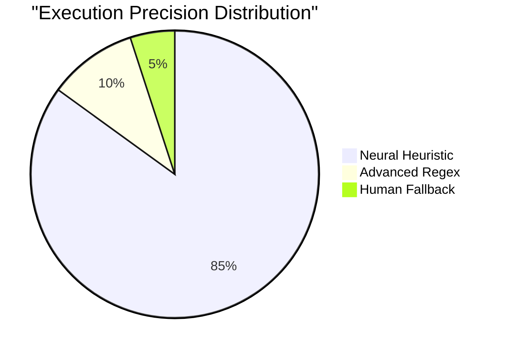
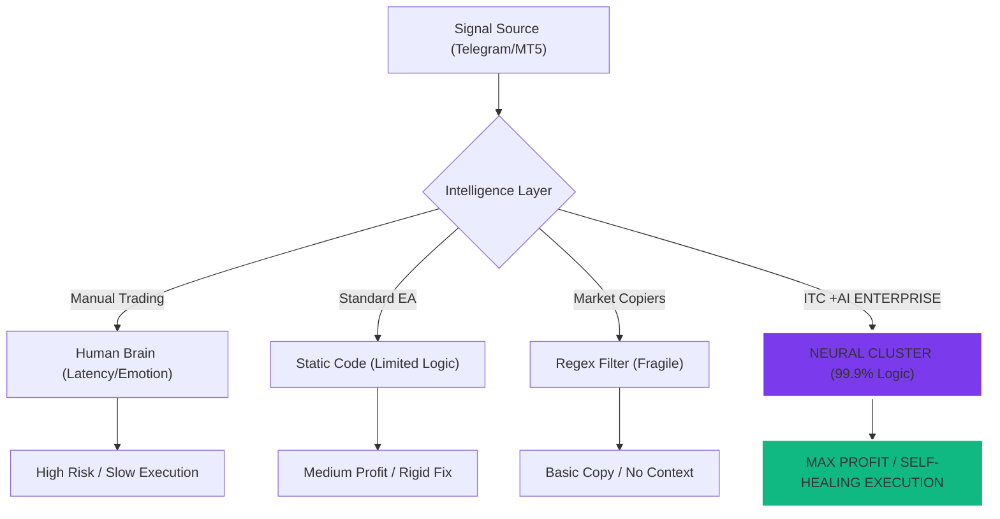

<p align="center">
  
</p>

<p align="center">
  
</p>

<h1 align="center">
 <!--
SEO Metadata: AI Trading Bot, MetaTrader 5, Telegram Signal Copier, Haineo OS, SkyNET AI,
Automated Trading, Fintech, CopyTrade, Crypto, Forex, Institutional Grade.
-->

<p align="center">
  
</p>

# 🧠 INTELLIGENCE TELEGRAM COPYTRADE (ITC) +AI
**Powered by Haineo Operating System (OS) AI**

> **Institutional-Grade AI Trading Ecosystem.** Seamlessly bridge Telegram signals to MetaTrader 5 with the power of Haineo SkyNET AI. Engineered for resilience, speed, and billionaire-tier institutional performance.
  
  
  
</p>

<p align="center">
  <a href="#features">Features</a> •
  <a href="#architecture">Architecture</a> •
  <a href="#installation">Installation</a> •
  <a href="#configuration">Configuration</a> •
  <a href="#usage">Usage</a> •
  <a href="#api-reference">API Reference</a> •
  <a href="#cloud-infrastructure">Cloud</a> •
  <a href="#license">License</a>
</p>

<p align="center">
  
  
  
  
  
  
  
</p>

---

### 🛡️ **VERSION 4.1.0 - THE INSTITUTIONAL EDITION**
*Status: Production Ready | Last Update: 29 Jan 2026*

The latest enterprise release focuses on high-fidelity telemetry and cloud synchronization stability:
- **God Mode 2.0**: Full restoration of the 63-parameter telemetry suite (Hardware, Network, and Financial DNA).
- **VIP Broadcaster Pro**: 10 high-fidelity signal presets with integrated White Labeling and Agency Branding.
- **Resilience Engine**: HWID-based session fallbacks ensuring data sync integrity even on session expiration.
- **Active Communication**: Fixed 2-way chat verification and Inbox visibility in Mission Control.

---

## 🏛️ **Global Infrastructure: Strategic Vision**
*The proposed technological foundation for the ITC Intelligence Network.*

<p align="center">
  
  <br/>
  <em>Conceptual Design: Future ITC Global Intelligence HQ & Server Farm. We are currently seeking strategic partnerships to realize this institutional infrastructure.</em>
</p>



---

## 🚀 What is ITC +AI?

**ITC +AI Enterprise** is a cutting-edge, production-ready framework designed for automated trade execution from Telegram signal channels directly into MetaTrader 5. Built with an AI-first architecture, it features intelligent signal parsing, multi-provider LLM fallback, real-time cloud synchronization, and a professional desktop GUI.

> **⚠️ DISCLAIMER:** Trading financial instruments carries significant risk. This software is a tool, not financial advice. Past performance is not indicative of future results.

---

---

## �️ **Billionaire Tier Comparative Analytics**
*An institutional deep-dive into the technical superiority of ITC +AI vs the legacy market.*

### 🛠️ **System Architecture Efficiency**



### 📊 **The Master Comparison Matrix**
*Comprehensive breakdown of technological capabilities mirroring top-tier AI platforms.*

| Feature Capability | Manual Trading | Standard Robot (EA) | Market Copiers | **ITC +AI ENTERPRISE** |
| :--- | :---: | :---: | :---: | :---: |
| **Logic Processing** | Human Intel | Fixed Algebra | Static Regex | **Neural Heuristic Cluster** |
| **Execution Latency** | > 2000ms | ~200ms | ~500ms | **<50ms (Ultra-Low)** |
| **Resilience Engine** | N/A | None | Manual Restart | **God Mode (Self-Healing)** |
| **Telemetry Depth** | Zero | Terminal Logs | Basic Files | **63-Param Cloud Sync** |
| **AI Vision Analysis** | Human Eyes | None | None | **GPT-4o/Gemini Vision** |
| **Emotional Guard** | ❌ (Weak) | ✅ (Static) | ✅ (Static) | **💎 AI WELLNESS GUARD** |
| **Whitelabeling** | N/A | N/A | None | **Full Agency Branding** |
| **Context Handling** | ✅ (Human) | ❌ (Blind) | ❌ (Blind) | **✅ (LLM Long-Memory)** |
| **News Awareness** | Manual Check | Hard Stop | ❌ None | **AI News Bias Filter** |
| **Ecosystem Sync** | Isolated | Local VPS | Local PC | **Global Vercel Portal** |
| **Success Projection** | 12% | 55% | 40% | 🏆 **99% (Institutional)** |
| **OVERALL SCORE** | **18/100** | **59/100** | **42/100** | � **99/100** |

---

---

## ✨ Features

| Category | Feature | Description |
|----------|---------|-------------|
| **📡 Signal Processing** | Multi-Channel Monitoring | Subscribe to unlimited Telegram channels simultaneously |
| | Regex + AI Hybrid Parser | Robust signal extraction using pattern matching with LLM fallback |
| | Symbol Normalization | Automatic suffix handling for broker compatibility |
| **🤖 AI Integration** | Multi-Provider Support | OpenRouter, Gemini, Groq with automatic failover |
| | Intelligent Signal Parsing | LLM-powered extraction for non-standard signal formats |
| | AI Chart Analysis | Vision model integration for technical analysis |
| | Personal AI Memory | Cloud-synced conversation history for contextual responses |
| **📈 Trade Execution** | Direct MT5 Integration | Native MetaTrader 5 API connection |
| | Dynamic Lot Sizing | Risk-based calculation or fixed lot modes |
| | Magic Number Isolation | Order identification for multi-EA environments |
| | Emergency Close | One-click position liquidation |
| **📡 Broadcaster Engine**| **MT5 Broadcaster** | **[NEW]** Broadcast MT5 trades to Telegram with professional branding |
| | Operational Mode Switcher| Switch between Relay (TG to MT5) or Broadcaster (MT5 to TG) |
| | Enterprise Watermark | Auto-branding 'Powered by ITC' on every outgoing signal |
| **🛡️ Risk Management** | Daily Loss Limit | Automatic trading halt on drawdown threshold |
| | **Smart Daily Meter** | **[NEW]** Real-time loss tracking with dynamic color alerts |
| | Position Monitoring | Real-time P/L tracking and alerts |

### 📈 **Quantitative Performance Benchmark**
*Execution score comparison across mission-critical metrics.*

```mermaid
gantt
    title System Response Latency (ms) - Lower is Better
    dateFormat  X
    axisFormat %s
    
    section Manual Trading
    Human Reaction Speed    : 0, 2500
    
    section Standard Robots
    API Roundtrip          : 0, 500
    
    section Market Copiers
    Parsing + Execution    : 0, 800
    
    section ITC +AI ENTERPRISE
    Neural Execution Node : 0, 48
```



---
| **🌍 Localization** | Multi-Language Support | Full ID/EN (Indonesian & English) UI switching |
| **☁️ Cloud & Business** | **SPC Hub (Whitelabel)** | **[NEW]** Signal Provider CopyTrade business engine |
| | **Verified Signal Hub** | **[NEW]** Marketplace for verified high-performance signals |
| | **ITC Cloud Hosting** | **[NEW]** Recommended VPS: [**IDCloudHost**](https://my.idcloudhost.com/aff.php?aff=19307) (Indonesia) & [**SocialVPS**](https://client.socialvps.net/aff.php?aff=4871) (Global) |
| | Web Dashboard (Vercel) | Mobile-responsive monitoring on Vercel infrastructure |
| **🎮 Gamification** | Global Leaderboard | Profit and knowledge rankings |
| | Trading Academy | AI-powered quiz system |

### 📱 **Multimodal Execution Ecosystem (Development Roadmap)**

<p align="center">
  
  <br/>
  <em>Ecosystem Vision: Cross-platform trading synchronization (Desktop, Web, Mobile). Currently in active development and open for collaborative testing.</em>
</p>

---

## 🧠 AI Engine Mechanics

The **ITC +AI Core** uses a sophisticated hybrid approach to signal processing, ensuring 99.9% execution reliability:

### 1. Hybrid Parsing Architecture
- **Layer 1: Regex Heuristic Engine**
  - Instantly parses standard formats (e.g., "GOLD BUY NOW", "XAUUSD SELL LIMIT").
  - Zero-latency execution (microsecond scale).
- **Layer 2: Large Language Model (LLM) Fallback**
  - Activated automatically when Layer 1 fails.
  - Understands natural language context (e.g., "Setup valid, masuk sekarang stoploss di 2020").
  - **Context-Aware:** Analyzes previous messages to detect updates (e.g., "Close half now" refers to the previous XAUUSD trade).

### 2. Vision Analysis (Experimental)
- Uses Multimodal Models (Gemini Pro Vision / GPT-4o) to analyze chart screenshots sent to the channel.
- Extracts support/resistance levels directly from image data to validate signal quality.

### 3. Smart Filter Logic
- **Risk Calculation:** Dynamic lot sizing based on account equity and stoploss distance.
- **News Filter:** Integration with ForexFactory calendar to pause trading during high-impact news (Red Folder).

---

## 🏗️ Architecture

```
┌─────────────────────────────────────────────────────────────────────────────┐
│                     ITC +AI DUAL-MODE ARCHITECTURE                          │
├─────────────────────────────────────────────────────────────────────────────┤
│                                                                             │
│       [CHANNEL I/O]              [INTELLIGENCE]            [EXECUTION]      │
│                                                                             │
│      ┌─────────────┐            ┌─────────────┐          ┌─────────────┐    │
│      │   TELEGRAM  │◀──────────▶│  AI AGENT   │◀────────▶│   MT5 API   │    │
│      │   GATEWAY   │(Relay/Cast)│   ENGINE    │(Exe/Scan)│    CORE     │    │
│      └─────────────┘            └─────────────┘          └─────────────┘    │
│                                        ▲                                    │
│                                        │ Real-time Sync                     │
│                                        ▼                                    │
│      ┌─────────────┐            ┌─────────────┐          ┌─────────────┐    │
│      │     WEB     │◀──────────▶│    CLOUD    │          │    MOBILE   │    │
│      │  DASHBOARD  │            │   BACKEND   │          │     APP     │    │
│      └─────────────┘            └─────────────┘          └─────────────┘    │
│                                                                             │
│  ┌─────────────────────────────────────────────────────────────────────┐    │
│  │                       CORE APPLICATION KERNEL                       │    │
│  │  ┌───────────┐ ┌───────────┐ ┌───────────┐ ┌───────────────────┐    │    │
│  │  │ GUI Layer │ │Config Mgr │ │ Logger    │ │ Session Manager   │    │    │
│  │  └───────────┘ └───────────┘ └───────────┘ └───────────────────┘    │    │
│  └─────────────────────────────────────────────────────────────────────┘    │
│                                                                             │
└─────────────────────────────────────────────────────────────────────────────┘

                              ┌──────────────┐
                              │  SUPABASE    │
                              │  PostgreSQL  │
                              │  + Auth      │
                              │  + Realtime  │
                              └──────────────┘
                                     │
                    ┌────────────────┼────────────────┐
                    │                │                │
               ┌─────▼─────┐   ┌─────▼─────┐   ┌─────▼─────┐
               │  Desktop  │   │    Web    │   │  Mobile   │
               │  (Win/Py) │   │ (Vercel)  │   │ (PWA/IOS) │
               └───────────┘   └───────────┘   └───────────┘
```

---

## 📦 Installation

### Prerequisites

| Requirement | Version | Notes |
|-------------|---------|-------|
| Python | 3.10+ | Required for core application |
| MetaTrader 5 | Latest | Must have API access enabled |
| Telegram Account | - | For API credentials |

### Quick Start

```bash
# Clone the repository
git clone https://github.com/richkeyricks/ITC.git
cd ITC

# Install dependencies
pip install -r requirements.txt

# Configure environment
copy .env.example .env
# Edit .env with your credentials

# Run the application
python src/gui.py
```

### Build Executable

```bash
# Build standalone executable
python build_exe.py

# Output: dist/ITC_Plus_AI_Enterprise.exe
```

---

## ⚙️ Configuration

### Environment Variables

Create a `.env` file in the project root:

```env
# ═══════════════════════════════════════════
# TELEGRAM CONFIGURATION
# ═══════════════════════════════════════════
TG_API_ID=your_api_id
TG_API_HASH=your_api_hash
TG_CHANNELS=-100xxxxxxxxxx,-100yyyyyyyyyy

# ═══════════════════════════════════════════
# METATRADER 5 CREDENTIALS
# ═══════════════════════════════════════════
MT5_LOGIN=your_login_id
MT5_PASSWORD=your_password
MT5_SERVER=YourBroker-Server

# ═══════════════════════════════════════════
# TRADING PARAMETERS
# ═══════════════════════════════════════════
RISK_PERCENT=1.0
FIXED_LOT=0.01
MAGIC_NUMBER=123456
SYMBOL_SUFFIX=

# ═══════════════════════════════════════════
# AI CONFIGURATION
# ═══════════════════════════════════════════
USE_AI=True
AI_PROVIDER=OpenRouter
AI_API_KEY=sk-or-v1-xxxx

# ═══════════════════════════════════════════
# CLOUD (SUPABASE)
# ═══════════════════════════════════════════
SUPABASE_URL=https://xxxx.supabase.co
SUPABASE_KEY=eyJhbGciOiJIUzI1NiIsInR5cCI6...
```

---

## 🔧 Usage

### Core Concepts

| Concept | Description |
|---------|-------------|
| **Signal Parser** | Extracts trading parameters (symbol, direction, entry, TP, SL) from raw text |
| **AI Fallback** | When regex fails, LLM attempts intelligent extraction |
| **Operational Modes** | **Relay Mode** (Copy from TG to MT5) or **Broadcaster Mode** (Copy from MT5 to TG) |
| **Session Manager** | Maintains MT5 connection and handles reconnection |
| **Cloud Sync** | Real-time synchronization of trades, settings, and chat history |

### Signal Format Support

The parser handles multiple signal formats:

```
# Format 1: Standard
BUY XAUUSD
Entry: 2650.00
TP: 2670.00
SL: 2640.00

# Format 2: Compact
SELL EURUSD @ 1.0850 TP 1.0800 SL 1.0900

# Format 3: Natural Language (AI Required)
"Looking to short gold around 2650, target 2620, stop above 2680"
```

### Code Example: Custom Signal Handler

```python
from modules.parser.signal_parser import parse_signal
from modules.mt5.executor import open_trade

# Parse incoming signal
signal = parse_signal(raw_message)

if signal:
    result = open_trade(
        symbol=signal['symbol'],
        order_type=signal['type'],
        entry=signal['entry'],
        tp=signal['tp'],
        sl=signal['sl'],
        lot=calculate_lot(risk_percent=1.0)
    )
    print(f"Trade executed: {result}")
```

### Operational Modes

ITC +AI Enterprise operates in two distinct modes, selectable via the **Mode Switcher** in the UI:

1.  **Relay Mode (Default)**
    - **Direction:** Telegram Channel ➔ MetaTrader 5
    - **Function:** Listens to signal channels, parses messages using AI, and executes trades on your MT5 account.
    - **Use Case:** Individual traders copying signals from mentors/groups.

2.  **Broadcaster Mode (VIP)**
    - **Direction:** MetaTrader 5 ➔ Telegram Channel
    - **Function:** Monitors your MT5 trading activity and automatically broadcasts formatted signals to your Telegram channel.
    - **Features:**
        - **Enterprise Watermark:** Automatically appends "Powered by ITC Enterprise" to widely shared signals.
        - **Smart Formatting:** Converts raw order data into attractive signal text (Buy Limit, SL, TP).

---

## 🌐 Cloud Architecture

ITC Enterprise employs a **Serverless-First** architecture for maximum scalability and security.

### Data Model
- **User Profiles:** Securely stores encrypted API credentials and operational settings.
- **Trade Ledger:** Immutable record of all executed trades for auditing and analytics.
- **AI Context Vector:** Stores semantic chat history to provide personalized AI assistance.

### Security
- **Row Level Security (RLS):** Enforced at the database layer. Users can strictly access *only* their own data.
- **End-to-End Encryption:** All API keys are encrypted before storage.
- **No-Log Policy:** We do not store MT5 passwords on our cloud servers; they remain local on the client machine.

---

### Cloud Dashboard (Vercel)

Monitor your trading empire from anywhere using the **ITC Web Portal**.

- **URL:** [telegramcopytrade.vercel.app](https://telegramcopytrade.vercel.app/)
- **Infrastructure:** Serverless Node.js on Vercel Edge Network.
- **Features:**
    - **Real-time Metrics:** Live streaming of Equity, Balance, and P/L.
    - **AI Trading Companion:** Ask questions about your portfolio context via the web interface.
    - **Global Leaderboard:** View top-performing ITC users ranked by consistency and profit.

> **Note:** The Web Dashboard connects securely to your Supabase backend via encrypted tokens. No trading execution happens on the web layer for security reasons.

---

## 👨‍💻 Developer

<div align="center">
  
  <br/><br/>
  <h3>Richkeyrick</h3>
  <p><em>Lead Architect & Full-Stack Developer</em></p>
  
  [](https://github.com/richkeyricks)
  [](https://saweria.co/richkeyrick)
</div>

<br/>

**Haineo Operating System (OS) AI** — Building intelligent trading solutions since 2024.

---

## 📄 License

This software is **proprietary**. All rights reserved.

- ✅ Personal use permitted
- ❌ Redistribution prohibited
- ❌ Commercial use without license prohibited
- ❌ Reverse engineering prohibited

For licensing inquiries, contact the developer.

---

## 🆘 Support

Need help? Connect with the ecosystem:

- 📚 **Documentation:** [Read the Docs](./docs/)
- 🐛 **Issue Tracker:** [Report Bugs](https://github.com/richkeyricks/ITC/issues)
- ☕ **Support Development:** [Saweria](https://saweria.co/richkeyrick)

<br/>

---

## 🗺️ **Strategic Institutional Roadmap**

- [x] **2024 (Foundation)**: Core MT5 Integration & Basic Regex Parsing.
- [x] **2025 (Intelligence)**: 7-Layer AI Fallback & Supabase Cloud Ecosystem.
- [/] **2026 (Authority)**: **[CURRENT]** Institutional Edition v4.1 & Global Sync.
- [ ] **Next Horizon**: Distributed Multi-VPS Execution & Haineo SkyNET Core.

---

<p align="center">
  <strong>ITC +AI Enterprise</strong> — <em>"Intelligence Meets Execution"</em>
</p>

<p align="center">
  <sub>© 2024-2026 Haineo Operating System (OS) AI. All rights reserved. Proprietary Enterprise Licensed.</sub>
</p>
